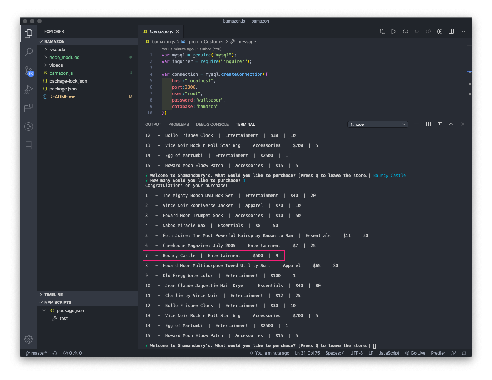

# bamazon
UTA-VIRT-FSF-PT-01-2020-U-LOL Homework #12 (Customer View)

### Node.js & MySQL

## Overview

This application is an Amazon-like storefront. The app takes in orders from customers and depletes stock from the store's inventory.

- - -

### Challenge #1: Customer View (Minimum Requirement)

Running the app logs a welcome message and displays available merchandise.

   

Users may key in the product they wish to purchase.

   

If the product is not recognized, the app will tell the customer that the store does not carry that item.

   

If the product is available, the app will ask the customer the quantity they'd like to purchase.

   

If the requested quantity is greater than the available stock, the app will let the customer know that the store does not have enough inventory to cover their requested amount.

   

If the requested quantity is fewer than the available stock, the app will congratulate the customer on their purchase and reduce the inventory by the purchased quantity.

   

   Initial Inventory:
   
   
   Inventory After Bouncy Castle Purchase:
   

The user may leave the store by pressing "Q".

   

- - -

## Learning Objectives
* Configure a Node.js application to connect to a MySQL instance
* Create and drop databases and tables 
* Explain and execute CRUD methods

- - -

## Key Topics
* MySQL Workbench
* MySQL command prompt
* Node.js
* Inquirer